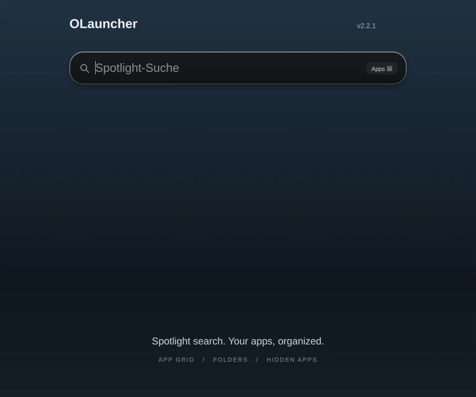

# OLauncher

A Spotlight-style launcher for Omarchy with unified app/file search, a calculator, animated most-used apps and a compact App Grid. Organize apps with drag-and-drop ordering, folders and reversible hiding, using the mouse or keyboard. No cloud services or telemetry.



[Watch or download the v1.1.0 demo (MP4)](https://github.com/hisnameismarco/OLauncher/releases/download/v1.1.0/olauncher-v1.1.0-demo.mp4). Recorded with isolated demo data on a neutral background.

## Version 1.1.0

- Coordinated frosted-glass styling with [ODock](https://github.com/hisnameismarco/odock): 24 px outer corners, softer light edges and shadows, and an 85% opaque launcher surface.
- System sans-serif UI text, quiet hover highlights and a small icon lift.
- English interface and decimal point calculator output; decimal comma input remains supported.
- Existing app order, folders, hidden apps and usage history are preserved.

## Features

- Press **Tab in an empty search**: up to four app circles flow out of the search field.
- Tab / Shift+Tab or Left / Right selects an app. Enter or a click launches it.
- The circles rank installed apps by **launches through OLauncher**, including launches from search results. They do not monitor other launchers or running windows.
- Before there is history, installed apps fill the slots alphabetically. Rankings update when reopening the launcher; the open rail never rearranges under your cursor.
- The empty **Apps** filter opens a compact, scrollable grid with manual ordering, folders, and reversible hidden apps. Typing returns immediately to search.
- Golden Gate / Liquid Glass inspired styling follows Omarchy's theme and remains readable without compositor blur.
- Search applications, filenames and arithmetic together. Filters: All, Apps, Files, Calculator.
- Decimal comma, multiplication/division symbols, powers and postfix percentages: `125*1,19` → `148.75` (decimal point output).
- Contextual actions: open, open containing folder, copy path/name/result.
- Commands run only with an explicit `>` prefix and activation.
- Cancelled requests cannot overwrite results for a newer query. File searches time out after 8 seconds.

The interface defaults to English, including actions, hints, folder controls and empty/error states. This is an independent Linux launcher inspired by Spotlight, not an Apple product or a pixel-exact macOS implementation.

## Requirements

- Omarchy **Quattro shell / plugin API v1**, Quickshell with Qt 6 Quick Effects, Hyprland.
- `python3`, `fd`, `wl-copy` (wl-clipboard), `xdg-open` (xdg-utils), `gtk-launch` (gtk3) and `uwsm`.
- Node.js is only needed to run the developer tests.
- Uses the system sans-serif font for the interface, Omarchy’s configured font for commands and keyboard hints, and Omarchy’s popup theme colors. No Apple fonts or icons are bundled. App icons come from the user’s icon theme.

## Install

Install from the public repository:

```bash
omarchy plugin add https://github.com/hisnameismarco/OLauncher.git --enable
```

For a local checkout, copy this repository to `~/.config/omarchy/plugins/olauncher/`, then enable OLauncher in **Setup → Plugins**. Do not overwrite an existing installation without backing it up.

The plugin ID is `olauncher`; its displayed name is **OLauncher**.

Open it with:

```bash
omarchy-shell shell toggle olauncher '{}'
```

You can bind that command using Omarchy's keybinding configuration. Installation does not replace existing shortcuts or modify Hyprland configuration.

### Optional background blur

The launcher works without blur. For the frosted background, enable Hyprland blur and add a layer rule to your user configuration. On Omarchy's Lua configuration:

```lua
hl.layer_rule({
  match = { namespace = "^olauncher$" },
  blur = true,
  ignore_alpha = 0.3,
})
```

Set `decoration.blur.enabled = true` in your existing `hl.config` settings block. This is a global compositor setting and also enables other configured blur rules. Validate configuration changes with `hyprctl reload` and `hyprctl configerrors`.

## Migration from earlier development builds

The marketplace requires lowercase community plugin IDs. Version 1.0 uses `olauncher`; the display name remains **OLauncher**. Earlier development builds used `marco.spotlight` or `OLauncher` as the plugin ID.

Back up the old installation, remove it with `omarchy plugin remove <old-id>`, then install OLauncher again using the command above. Update launcher shortcuts to `olauncher` and change the old blur namespace (`marco-spotlight` or `OLauncher`) to `olauncher`. Do not leave both versions enabled. The existing `spotlight-usage.json` file is retained so app rankings survive the rename.

## Controls

| Input | Behavior |
|---|---|
| Tab in an empty search | Reveal / cycle most-used app circles |
| Shift+Tab, Left / Right with circles open | Cycle apps |
| Enter or click an app circle | Launch that app |
| Start typing | Retract circles and search |
| Up / Down, Page Up / Down | Select a search result |
| Tab with search results | Open / cycle contextual actions |
| Ctrl+Left / Right | Change search filter |
| Escape | Close circles/actions → reset filter → clear query → close |
| `>` followed by a command | Explicit shell command mode |

## Data and limitations

Only app IDs and launch counters are saved in `~/.local/state/spotlight-usage.json`. They count launch requests made via this plugin, not whether the launched program ultimately starts successfully. No keystroke/search history is stored or sent anywhere. Reset by removing that file while the shell is stopped, then restart the shell.

Filename search covers non-hidden, non-ignored files under `$HOME`, up to depth 8. It excludes `node_modules` and `.git`, returns up to 40 results from at most 80 candidates and does not search document contents. Missing applications disappear from the quick-launch list. If fewer than four are installed, only available apps are shown.

## Development

```bash
omarchy plugin validate .
node tests/launcher.test.cjs
python3 tests/search_files_test.py
python3 tests/layout_store_test.py
python3 tests/clean_install_test.py
QT_QPA_PLATFORM=offscreen QT_QUICK_BACKEND=software /usr/lib/qt6/bin/qmltestrunner -input tests
bash scripts/build-shaders.sh
```

Precompiled Qt shader assets are included for installation. `qt6-shadertools` is needed only when rebuilding the shader. Source edits to a kept-loaded instance may require `omarchy restart shell`.

The clean-install test requires a running Wayland session, Omarchy and
`dbus-run-session`. It installs a local Git snapshot using the real plugin CLI,
with temporary HOME/XDG directories and a copied host. Launch requests are
captured without opening applications; the production plugin is not touched.

## Remove

```bash
omarchy plugin remove olauncher
```

Remove any shortcut or blur rule you added yourself. Usage history and the Apps layout file are retained; remove them separately if desired. The plugin installs no background daemon or global configuration.

## License and acknowledgements

GPL-3.0-only. The liquid morph is adapted from [StatIndet/quickshell](https://github.com/StatIndet/quickshell). See [THIRD_PARTY_NOTICES.md](THIRD_PARTY_NOTICES.md) and [LICENSE](LICENSE). This repository includes source for the modified shader as well as its compiled QSB asset.

### Apps grid

Choose **Apps** with an empty search to browse the application grid. Type to
return to the existing Apps search; clearing the query restores the grid and
its selection. Apps initially use display-name order with desktop-entry ID as the tie-breaker.
The **Apps ▦** button in the initial search field also opens this grid;
**Tab** continues to reveal the most-used app circles.
Drag an app to an insertion marker to reorder the grid independently of search
scores and usage history.

Use arrow keys to select, Enter or a click to launch, and scroll vertically to
browse. Down into a short final row selects its last available app. Ctrl+Left /
Right still switches filters. At root, Escape closes actions first, then returns
to All; inside a folder, Escape returns to the root grid.
Tab retains its existing behavior: actions in Apps, most-used circles in
All with an empty query.

Open directly in Apps mode:

```bash
omarchy-shell shell toggle olauncher '{"filter":"apps"}'
```

For an integration that should open Apps even if OLauncher is already visible:

```bash
omarchy-shell shell summon olauncher '{"filter":"apps"}'
```

Missing, malformed, or unsupported payloads open the normal All mode. The grid
uses the shell's shared application catalog and reacts to catalog changes.
Grid launches contribute to the existing usage history.

### Folders

Hold a dragged app over another app's center for about 400 ms, until the folder
outline and “Ordner erstellen” hint appear, then drop. The new folder replaces
the target app, with the target app first and the dragged app second inside.
Drop near a cell edge for ordinary reordering. Hover over an existing folder's
center to append a root app to it. Folders themselves can be reordered, but
cannot be nested.

Click a folder or press Enter to open it inside the launcher. Arrow keys select
its apps; Enter launches normally. Escape or the back arrow returns to the root
grid with the folder selected. Typing closes the folder and searches **all apps**;
clearing the query returns to the root grid. Folder organization never changes
search relevance or most-used circles.

Right-click a root folder, or select it and use Tab and arrow keys to choose an
action:

- **Umbenennen:** edit its name; Enter saves and Escape cancels. Names are plain
  text, trimmed, and limited to 64 characters; an empty name keeps the old name.
- **Ordner auflösen:** remove the container and return its apps to that position
  at root, preserving their order. Applications are never uninstalled.

Inside a folder, drag to reorder its apps. The **Aus Ordner entfernen** action
returns the selected app immediately after the folder. Empty folders disappear;
a folder with one remaining app dissolves into that app at its root position.
Drag-out and an Add-to-Folder chooser are not provided.

Drag uses a movement threshold and pointer-following ghost. Drop outside the
grid or press Escape to cancel. Scroll before or during a drag to reach other
rows; there is no automatic edge scrolling. Typing, catalog changes, and column
changes cancel an active drag safely. No layout is saved during hover.

### Layout storage

Order and folders are saved with a 200 ms debounce and atomic replacement in
`${XDG_STATE_HOME:-$HOME/.local/state}/olauncher/apps-layout.json`:

```json
{
  "version": 2,
  "items": [
    {"type": "app", "appId": "firefox"},
    {"type": "folder", "id": "folder-example", "name": "Development",
     "apps": ["kitty", "code"]}
  ],
  "hidden": []
}
```

App IDs remain exactly as supplied by the shared catalog. Existing v1 layouts
migrate automatically, preserving their order and unavailable IDs. New apps
append at root in name/ID order. Catalog changes affect only the visible layout;
an empty startup catalog cannot erase saved organization. Apart from supported
migration, only explicit layout mutations write state.

Missing/empty state uses defaults. Invalid state warns and uses defaults until
an explicit mutation. Newer schemas and unreadable files stay protected: folder
and reorder operations work for the session but never overwrite those files.
Save failures retain in-memory state and warn in the Quickshell log. Allow the
save debounce to finish before stopping the shell. The legacy usage-history
path is unchanged.

Use **Hide from OLauncher** (German UI: **Aus OLauncher ausblenden**) in an
app's actions, at root, inside a folder, or in search results. Right-click or
use Tab to select the action and Enter to apply it. Hidden apps disappear from
the grid, Apps/All app search results, and most-used circles; they are not
uninstalled and their usage counters remain intact.

In the empty Apps grid, click **Ausgeblendet** or press **Ctrl+H** to manage
hidden apps. Up/Down selects an app and Enter restores it. The final **Alle
einblenden** row restores all, including unavailable IDs. Escape returns to the
grid. Unavailable apps are omitted from the management list.

Hiding preserves root positions and folder membership/order. A folder with one
visible member stays a folder; a fully hidden folder disappears until a member
is restored. Reordering moves only the dragged item before/after a visible
anchor and preserves every other stored record's relative order, including
hidden apps. Explicit folder deletion returns all members (including hidden
ones) to root; ordinary structural cleanup still uses stored membership.

Hidden IDs use the optional `hidden: ["app-id"]` field in the same v2 layout
file. Older v2 files default to no hidden apps. Hidden IDs survive catalog
absence/reinstallation. Hide/restore actions use the same debounced atomic
save, and remain session-only when a future schema is protected.

Store tests use isolated Quickshell instances and temporary HOME/XDG state
paths; they never write the installed plugin or user layout.
